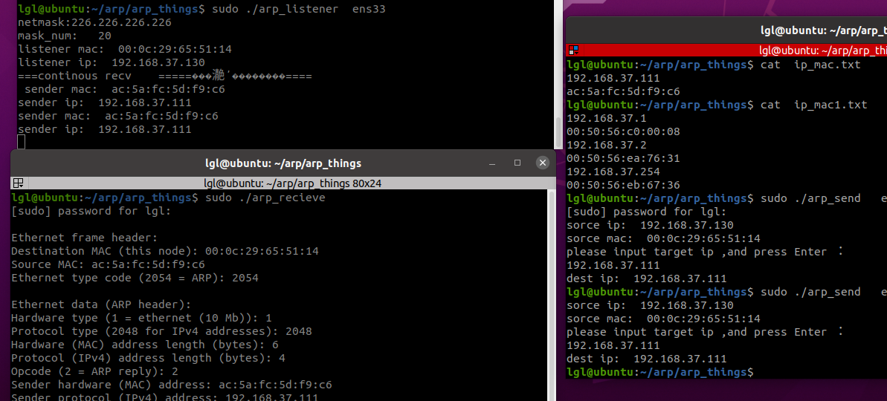
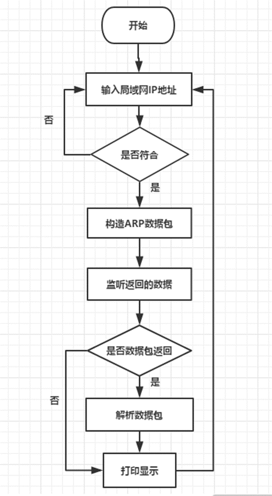

#####  arp 测试 

#### 介绍
（1）实验室环境下，发送端将包含目标IP地址的ARP请求广播到局域网络上的所有主机，并接收返回消息。
（2）简单用户界面：显示IP地址和相对应的MAC地址。

#### 软件主要功能：
1、基础通用功能定义
2、向指定ip发送arp数据包
3、功侦听和接收ARP包，显示接收到的包内容
4、持续接收功侦听和接收ARP包， 显示接收到的IP和mac
5、列出局域网内活动主机的ip和mac，保存到指定的文本文件中

#### 开发教程  ,请参考  document/进展报告2.doc

####  实验环境：

Vmware下面安装 Linux系统，
VMware® Workstation 17 Pro
Unbuntu 20.4  
Winscp5.21 ，
SecureCRT 8.5
#### 编程语言
C语言， gcc 9.4.0

#### 程序主要流程
 

#### 联系方式 QQ  75039960
 
